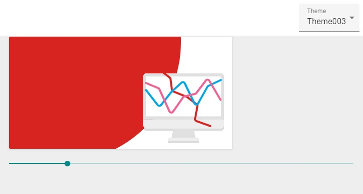

# svg-d3

This is a React Web App which controls the SVG element using D3.js

[](https://app.netlify.com/sites/thirsty-kirch-cd2298/deploys)



## Project setup

```
npm install
```

## Project run

```
npm start
```
